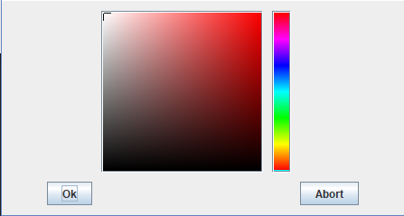

# Rapport de projet Java :  Application de dessin vectoriel (ébauche)

# Pain-t
<!--  -->

## Fonctionnalités du prototype
L'application a été développée selon le cahier des charges et les fonctionnalités bonus ont été reprises de l'application Microsoft Paint.

Voici la liste exhaustive des fonctionnalités :
* Sélection :
   * Sélection de la forme au click ;
   * Sélection de plusieurs formes en appuyant sur **Shift** tout en cliquant sur les formes ;
   * Sélection des formes au lasso (click and drag) ;
   * Sélection de toutes les formes via **Ctrl + A** ;
   * Navigation et sélection des formes via **Tab** ;
   * Désélection de toutes les formes sélectionnées via **Echap** ;
* Déplacement :
   *  Déplacement des formes sélectionnées au click and drag ;
   *  Déplacement des formes sélectionnées via les flèches du clavier ;
* Création des formes à la volée ;
* Modification :
   * Modification des attributs des formes à la volée ;
   * Redimensionnement des formes via les *handlers* ;
   * Pivot de 90° des formes sélectionnées ;
   * Changement de plan d'un figure ;
* Sauvegarde :
   * Sauvegarde sous le format d'une image ;
   * Sauvegarde sous l'image d'un script (afin de reprendre l'édition du projet) ;
   * Chargement du script ;
* Outils :
   * Zoom du canevas (pas de modification de la taille des formes)

### Raccourcis clavier :
   * **Ctrl + A** : Sélection de toutes les formes ;
   * **Tab** : Navigation et sélection des formes ;
   * **Echap** : Désélection de toutes les formes sélectionnées ;
   * **Suppr** : Suppression des formes sélectionnées ;
   * **Ctrl + C** : Copie des formes sélectionnées ;
   * **Ctrl + V** : Collage des formes copiées ;
   * **Ctrl + X** : Copie et collage des formes sélectionnées ;
   * **Flèches du clavier** : Déplacement les formes sélectionnées ;
   * **P** : Pivot de 90° des formes sélectionnées ;
   * **1** : Met la dernière forme sélectionnée à un plan plus proche ;
   * **2** : Met la dernière forme sélectionnée à un plan plus éloigné ;

## Choix de l'implantation

Dans le projet initial, le modèle ne notifiait pas la vue d'un éventuel changement. La première modification a donc été de rajouter cette fonctionnalité. Pour ce faire, la classe [**ShapeModel**](./src/graphics/shapes/ShapeModel.java) a été ajouté. Elle contient notemment la création des différentes formes de base et la récupération de ces formes. Dans les classes concernant le modèle, (les formes et les attributs), le design pattern observer a été implanté.

Les méthodes de modifications de ces classes apellent la méthode **notifyObservers()** qui apelle a son tour la méthode **notify()** de l'observer, qui raffraichit la fênetre pour mettre a jour la vue.

**Nico, tu écriras ton bordel. **
Afin de supporter les nouvelles fonctionnalités, l'interface a subit de nombreux changement (développement par *Nicolas Herr*).
Pour pouvoir modifier plus facilement les shapes, un bandeau de contrôle a été ajouté.

Il est décomposé en trois **JPanel**.
* Le panel pour la création de formes de bases.
* Le panel pour la modification des couleurs des formes.
* Le panel de modification des attributs texte (disponible uniquement qd une forme texte est selctionné).

Dans le premier **JPanel**, les formes sont créés. Voir [Partie leslie](#leslie)

Dans le second, nos avons toutes les modificateurs liées à la couleurs. Lors d'un click sur une formes, les éléments vont s'adapter en fonction de la forme selectionnée. Si la couleur de remplissage est activé, la **JCheckBox** sera cochée.
Le bouton de remplissage et le bouton de contour, sont des **JButton** customisés.
La méthode **paintComponent()** a été réécrite. Le petit rectangle gris sur l'image indique la couleur en cours.

Lors du click sur un bouton, un menu **JPopupMenu** s'ouvre. Cette popup contient un élément permettant de choisir la couleur voulu ainsi qu'un bouton de validation et un d'abbandon.  
Le selectionneur de couleur est un **JColorChooser** customisé [voir **ColorChooser**](./src/graphics/shapes/ui/component/ColorChooser.java).

* Le bouton **OK** permet  d'appliquer la couleur a la forme selectionnée.
* Le bouton **ABORT** permet de fermer la popup sans rien modifier.

Dans le dernier, ...

**Manon, tu écriras ton bordel. **
Les formes retenues sont le **SRectangle**, le **SOval**, le **SText** et la **SCollection**. Le SCircle a été remplacé par le SOval, puisque plus logique au niveau du programme. L'objet **Graphics2D** au niveau du **ShapesDraftman** dessine les formes selon leurs limites, selon le cadre les contenant. Ainsi, en implantant le SOval comme une classe fille de SRectangle, SOval peut hériter de ses comportements (comme le redimensionnement via les handlers).

**JN, tu écriras ton bordel. **

### 

**Leslie, tu écriras ton bordel. **

## Créateurs
* Nicolas Herr ;
* Manon Heyser ;
* Jean-Noël Balanche ;
* Leslie Caron.
